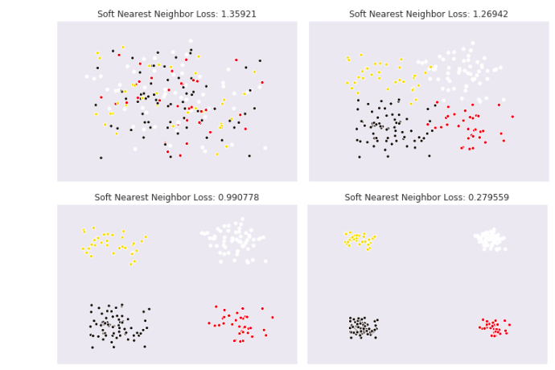

# Soft Nearest Neighbor Loss

[](https://www.gnu.org/licenses/agpl-3.0)
[](https://www.python.org/downloads/release/python-377/)
[](https://www.python.org/downloads/release/python-382/)

## Overview



_Figure from SNNL (Frosst et al., 2019). Using the soft nearest
neighbor loss, the our classes sampled from a Gaussian become more isolated._

Representation learning is the task of learning the most salient features in a
given dataset by a deep neural network. It is usually an implicit task done
in a supervised learning paradigm, and it is a crucial factor in the success of
deep learning (Krizhevsky et al., 2012; He et al., 2016; Simonyan et al., 2014).
In other words, representation learning automates the process of feature
extraction. With this, one can use the learned representations for downstream
tasks such as classification, regression, and synthesis.

One can influence how the learned representations are formed to cater specific
use cases. In the case of classification, the representations are primed to
have data points of the same class to flock together, while for generation
(e.g. in GANs), the representations are primed to have points of real data
flock with the synthesized ones.

In years of research and development, we have enjoyed the use of principal
components analysis (PCA) for encoding features for downstream tasks. However,
we do not have any class or label information from PCA-encoded representations,
hence the performance on downstream tasks may be further improved. We can
improve the encoded rerpesentations by integrating the class neighborhood
structure of the dataset, i.e. which features are clustered together, and such
clusters would imply that the features belong to the same class as per the
clustering assumption in the semi-supervised learning literature (Chapelle et
al., 2009). To integrate the class neighborhood structure in the
representations, manifold learning techniques have been introduced such as
locally linear ambeddings or LLE (Roweis & Saul, 2000), neighborhood components
analysis or NCA (Roweis et al., 2004), and t-stochastic neighbor embedding or
t-SNE (Maaten & Hinton, 2008).

However, the aforementioned manifold learning techniques have their own
drawbacks. For instance, both LLE and NCA encode linear embeddings instead of
nonlinear embeddings. Meanwhile, t-SNE embeddings result to different
structures, so one may argue that it is not encoding the actual neighborhood
structure of the dataset.

To avoid such drawbacks, we can use an improved NCA algorithm which is the
_soft nearest neighbor loss_ or SNNL (Frosst et al., 2019). The SNNL improves
over the NCA algorithm by introducing nonlinearity, and it is computed for each
hidden layer of a neural network instead of solely on the last encoding layer.
This loss function is used to optimize the entanglement of points in a dataset.

In the context of this work, _entanglement_ is defined as how close
class-similar data points to each other compared to class-different data points.
A low entanglement means that class-similar data points are much closer to each
other than class-different data points. Having such a set of data points will
render downstream tasks much easier to accomplish with an even better performance.
To measure the entanglement of data points, Frosst et al. (2019) expanded the
non-linear neighborhood components analysis (NCA) (Salakhutdinov and Hinton, 2007)
objective by introducing the temperature factor _T_, and called this modified
objective the _soft nearest neighbor loss_.

## Usage

It is recommended to use a virtual environment in order to isolate the
installation of this package to projects in which it will be used.

```shell script
$ virtualenv venv --python=python3
```

Then, the loss function along with template models can be installed via `pip`.

```shell script
$ pip install pt-snnl
```

This package consists of sample models that use the soft nearest neighbor loss
as a regularizer, and they are as follows:

- Feed-Forward Neural Network (customizable)
- Convolutional Neural Network (2 convolutional layers followed by 1 fully connected layer)
- Feed-Forward Autoencoder (x-500-500-2000-d-2000-500-500-x units)
- ResNet18 and ResNet34

Aside from the mentioned models above, the loss function can also be used in a
custom `torch.nn.Module` class in the following manner,

```python
from snnl import SNNLoss


class Net(torch.nn.Module):
    def __init__(self):
        super().__init__()
        self.fc_layer_1 = torch.nn.Linear(784, 500)
        self.a1 = torch.nn.ReLU(inplace=True)
        self.fc_layer_2 = torch.nn.Linear(500, 500)
        self.a2 = torch.nn.ReLU(inplace=True)
        self.fc_layer_3 = torch.nn.Linear(500, 30)
        self.a3 = torch.nn.ReLU(inplace=True)
        self.output_layer = torch.nn.Linear(30, 10)

    def forward(self, features):
        activations = self.fc_layer_1(features)
        activations = self.a1(activations)
        activations = self.fc_layer_2(activations)
        activations = self.a2(activations)
        activations = self.fc_layer_3(activations)
        activations = self.a3(activations)
        logits = self.output_layer(activations)
        return logits


model = Net()
criterion = SNNLoss(mode="custom", factor=10.0)

...
train_loss, xent_loss, snn_loss = criterion(
    outputs=outputs,
    model=model,
    features=batch_features,
    labels=batch_labels,
)
```

## Results


| Model                   | Baseline   | SNNL       |
| ----------------------- | ---------- | ---------- |
| MNIST (Average)         | 95.32%     | **95.77%** |
| MNIST (Best)            | 95.93%     | **96.2%**  |
| Fashion-MNIST (Average) | 89.1%      | **89.12%** |
| Fashion-MNIST (Best)    | **89.76%** | **89.48%** |
| EMNIST (Average)        | 82.66%     | **82.74%** |
| EMNIST (Best)           | 82.86%     | **82.96%** |
| KMNIST (Average)        | **90.58%** | 90.14%     |
| KMNIST (Best)           | **90.67%** | **90.67%** |

## References

- Agarap, Abien Fred, and Arnulfo P. Azcarraga. "Improving k-Means Clustering
  Performance with Disentangled Internal Representations." arXiv preprint
  arXiv:2006.04535 (2020).
- Frosst, Nicholas, Nicolas Papernot, and Geoffrey Hinton. "Analyzing and improving representations with the soft nearest neighbor loss." arXiv preprint arXiv:1902.01889 (2019).
- Salakhutdinov, Ruslan, and Geoff Hinton. "Learning a nonlinear embedding by
  preserving class neighbourhood structure." Artificial Intelligence and
  Statistics. 2007.
